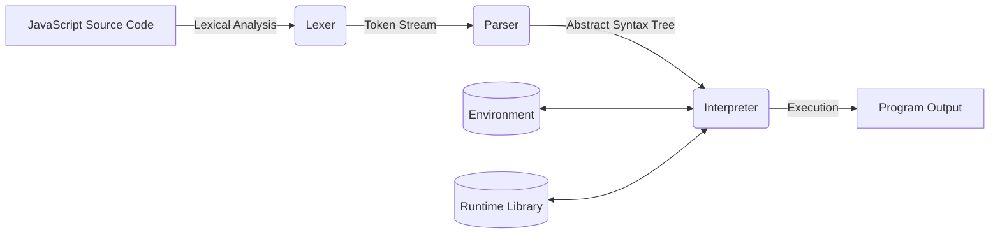

# ⚡ ThunderJS

## A High-Performance JavaScript Runtime Built in Python

ThunderJS is a custom JavaScript interpreter engineered entirely from scratch using **Python**. Developed for **THUNDER HACKATHON 2.0**, it demonstrates the core principles behind programming language implementation by building a complete execution pipeline consisting of a **Lexer**, **Recursive Descent Parser**, **Abstract Syntax Tree (AST)**, and **Interpreter**.

Instead of relying on existing JavaScript engines like **Google V8**, ThunderJS parses and executes JavaScript code through its own runtime implemented in Python.

---

# 🏗️ Architecture

ThunderJS follows the traditional interpreter architecture used in modern programming languages.



---

# ⚙️ How ThunderJS Works

Every JavaScript program executed by ThunderJS passes through multiple stages before producing the final output.

## 1. `main.py` – Entry Point

`main.py` is responsible for starting the execution process.

It:

* Reads the JavaScript source file
* Initializes the runtime
* Sends the source code to the lexer
* Passes generated tokens to the parser
* Executes the resulting AST using the interpreter

It acts as the coordinator for the entire runtime.

---

## 2. `lexer.py` – Lexical Analysis

The lexer scans raw JavaScript source code and converts it into meaningful **tokens**.

Example:

```javascript
let x = 10;
```

becomes:

```text
KEYWORD(let)
IDENTIFIER(x)
ASSIGN(=)
NUMBER(10)
SEMICOLON(;)
```

Breaking code into tokens makes it easier for the parser to understand the language syntax.

---

## 3. `parser.py` – Syntax Analysis

The parser receives tokens from the lexer and builds an **Abstract Syntax Tree (AST)**.

For example:

```javascript
let x = 10;
```

is transformed into a structured tree representing:

* Variable Declaration
* Variable Name (`x`)
* Assigned Value (`10`)

The AST preserves the logical structure of the program for execution.

---

## 4. `ast_nodes.py` – AST Definitions

This module defines every node type used inside the Abstract Syntax Tree.

Examples include:

* Number Literals
* String Literals
* Binary Expressions
* Variable Declarations
* Function Declarations
* Function Calls
* Conditional Statements
* Loops
* Array Expressions

Each node represents a JavaScript construct in object-oriented form.

---

## 5. `interpreter.py` – AST Execution

The interpreter recursively traverses the AST and evaluates every node.

For example:

```javascript
5 + 7
```

The interpreter:

1. Visits the left operand (`5`)
2. Visits the right operand (`7`)
3. Applies the `+` operator
4. Returns `12`

It is responsible for executing:

* Expressions
* Variable assignments
* Function calls
* Control flow
* Loops
* Recursion
* Scope resolution

This component forms the core execution engine of ThunderJS.

---

## 6. `environment.py` – Scope & Memory Management

The environment stores variables, constants, and functions during execution.

For example:

```javascript
let age = 20;
```

is internally stored similarly to:

```python
{
    "age": 20
}
```

It also supports nested scopes, allowing correct handling of local and global variables.

---

## 7. `runtime.py` – JavaScript Runtime Library

The runtime bridges JavaScript built-in APIs to their Python implementations.

Examples:

```javascript
console.log("Hello");
```

internally executes:

```python
print("Hello")
```

and

```javascript
Math.floor(5.9);
```

maps to:

```python
math.floor(5.9)
```

This module provides support for built-in objects such as `console`, `Math`, `Date`, and other standard library functionality.

---

# 🔥 Key Features

| Category         | Supported Features                                                        |
| :--------------- | :------------------------------------------------------------------------ |
| **Variables**    | `let`, `const`, `var` with proper block and function scoping              |
| **Data Types**   | `Number`, `String`, `Boolean`, `Null`, `Undefined`, `Array`, `Object`     |
| **Control Flow** | `if`, `else`, `for`, `while`, `do...while`                                |
| **Functions**    | Function declarations, expressions, arrow functions, callbacks, recursion |
| **Arrays**       | Spread operator, `push`, `pop`, `map`, `filter`, `reduce`, and more       |
| **Strings**      | `length`, `split`, `slice`, `substring`, `toUpperCase`, etc.              |
| **Built-ins**    | `console.log`, `Math`, `Date`                                             |

---

# 📸 Example Programs

## Odd / Even Checker

```javascript
let num = 7;

if (num % 2 === 0) {
    console.log(num + " is Even");
} else {
    console.log(num + " is Odd");
}
```

**Output**

```text
7 is Odd
```

---

## Triangle Pattern

```javascript
for (let i = 1; i <= 5; i++) {
    let row = "";
    for (let j = 1; j <= i; j++) {
        row += "*";
    }
    console.log(row);
}
```

**Output**

```text
*
**
***
****
*****
```

---

## Palindrome Checker

```javascript
function isPalindrome(str) {
    let rev = str.split("").reverse().join("");
    return str === rev;
}

console.log(isPalindrome("racecar"));
```

**Output**

```text
true
```

---

# 📂 Project Structure

```text
ThunderJS/
│
├── examples/              # JavaScript test programs
├── ast_nodes.py           # AST node definitions
├── lexer.py               # Lexical analyzer
├── parser.py              # Recursive descent parser
├── interpreter.py         # AST evaluator
├── environment.py         # Variable and scope management
├── runtime.py             # Built-in runtime library
├── main.py                # CLI entry point
└── README.md
```

---

# 🚀 Getting Started

## Prerequisites

* Python 3.7 or higher

## Clone the Repository

```bash
git clone <your-repository-url>
cd ThunderJS
```

## Run a JavaScript File

```bash
python main.py examples/odd_even.js
```

---

* **Project:** VoltJS
* **Language:** Python
* **Objective:** Build a functional JavaScript interpreter from scratch using compiler and interpreter design principles.

VoltJS demonstrates how JavaScript source code can be tokenized, parsed into an Abstract Syntax Tree, and executed through a custom Python runtime, providing an educational and practical implementation of language design concepts.
