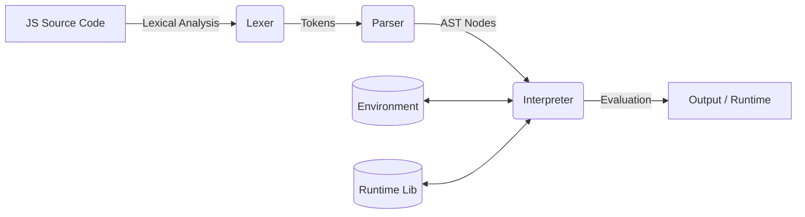

# ⚡ ThunderJS

**A High-Performance JavaScript Runtime Built in Python**

ThunderJS is a custom JavaScript interpreter engineered from the ground up for the **THUNDER HACKATHON 2.0**. It features a full pipeline including a Lexer, a Recursive Descent Parser, and an AST-based Interpreter to bring JavaScript execution to the Python environment.

---

## 🏗️ Architecture Flow

ThunderJS follows a classic interpreter design:



---

## 🔥 Key Features

| Category | Supported Features |
| :--- | :--- |
| **Variables** | `let`, `const`, `var` (Block & Function Scoping) |
| **Data Types** | `Number`, `String`, `Boolean`, `Null`, `Undefined`, `Array`, `Object` |
| **Control Flow**| `if-else`, `for`, `while`, `do...while` |
| **Functions** | Declarations, Expressions, Arrow Functions, Callbacks, Recursion |
| **Arrays** | Spread `[...]`, `push`, `pop`, `map`, `filter`, `reduce`, etc. |
| **Strings** | `length`, `split`, `slice`, `substring`, `toUpperCase`, etc. |
| **Built-ins** | `console.log`, `Math`, `Date` |

---

## 📸 Test Showcases (Code & Output)

Below are some of the primary test cases used to validate the runtime.

### 1. Odd/Even Checker
**File:** `examples/odd_even.js`
```javascript
let num = 7;

if (num % 2 === 0) {
    console.log(num + " is Even");
} else {
    console.log(num + " is Odd");
}
```
**Output:**
> `7 is Odd`

### 2. Triangle Pattern Generation
**File:** `examples/triangle.js`
```javascript
for (let i = 1; i <= 5; i++) {
    let row = "";
    for (let j = 1; j <= i; j++) { 
        row += "*"; 
    } 
    console.log(row); 
}
```
**Output:**
```text
*
**
***
****
*****
```

### 3. Palindrome Check
**File:** `examples/palindrome.js`
```javascript
function isPalindrome(str) {
    let rev = str.split("").reverse().join("");
    return str === rev;
}
console.log("Is 'racecar' palindrome?", isPalindrome("racecar"));
```

---

## 📂 Project Structure

```text
├── examples/           # Test cases (.js files)
├── ast_nodes.py        # AST Node classes
├── lexer.py            # Tokenizer
├── parser.py           # Recursive Descent Parser
├── interpreter.py      # AST Evaluator
├── environment.py      # Scope Management
├── runtime.py          # Built-in Library (Math, Console, etc.)
├── main.py             # CLI Entry Point
└── README.md           # Documentation
```

## 🚀 Getting Started

### Prerequisites
- Python 3.7 or higher

### Installation
```bash
git clone <your-repo-link>
cd thundersssss
```

### Usage
Run any JavaScript file using the following command:
```bash
python main.py examples/odd_even.js
```

---

## 🏆 Hackathon Details
- **Event:** THUNDER HACKATHON 2.0
- **Project Name:** ThunderJS
- **Goal:** Create a functional JS interpreter in Python.


